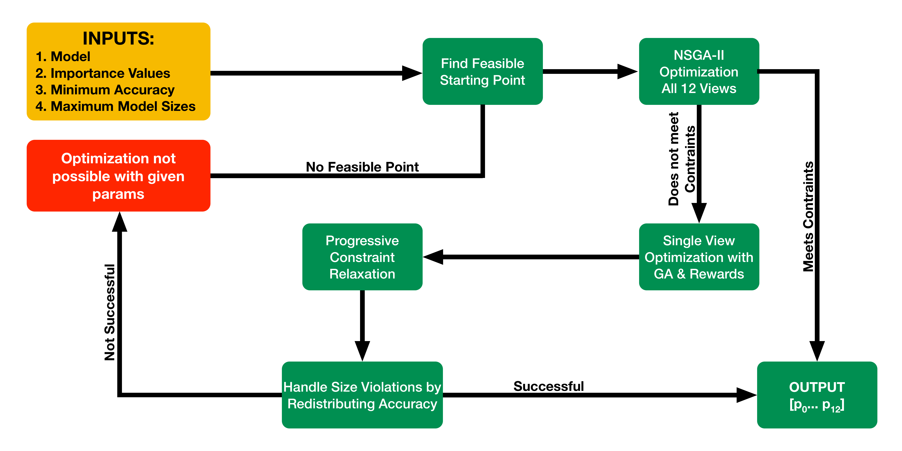

# DDNN Working Directory

## Directory Structure

```text
.
├── initialise_remote_machine.sh
├── README.md
└── src
    ├── MVCNN       [1]
    │   ├── convert_multi.py
    │   ├── convert.py
    │   ├── models
    │   │   ├── Model.py
    │   │   └── MVCNN.py
    │   ├── MVCNN
    │   │   └── model-mvcnn-00050.pth
    │   ├── pytorch3d_render.py
    │   ├── reorganise.py
    │   ├── SVCNN
    │   │   └── model-svcnn-00050.pth
    │   ├── tools
    │   │   ├── ImgDataset.py
    │   │   └── Trainer.py
    │   └── train_mvcnn.py
    └── pruning       [2]
        ├── RL       [3]
        │   ├── ComprehensiveVGGPruner.py
        │   ├── diagrams.pu
        │   ├── GetAccuracy.py
        │   └── PPO.py
        └── taylor_series     [4]
            ├── incremental-pruning    [5]
            │   ├── FilterPruner.py
            │   ├── importance.py
            │   ├── main_mvcnn.py
            │   ├── main-general-cnns.py
            │   ├── PFT_MVCNN.py
            │   ├── PFT.py
            │   ├── Pruning.py
            │   ├── reorganise-modelnet40.py
            │   ├── results
            │   │   ├── MVCNN Results.prism
            │   │   └── pruning-results-20250702-124835.csv
            │   └── Rewards.py
            ├── intermediate-tests-results
            │   ├── computation_time_alexnet.ipynb
            │   ├── intermediate-tests
            │   │   ├── FilterPruner.py
            │   │   ├── main.py
            │   │   ├── model_info.ipynb
            │   │   ├── MVCNN
            │   │   │   ├── convert_multi.py
            │   │   │   ├── convert.py
            │   │   │   ├── models
            │   │   │   │   ├── Model.py
            │   │   │   │   └── MVCNN.py
            │   │   │   ├── pytorch3d_render.py
            │   │   │   ├── reorganise.py
            │   │   │   ├── testing.ipynb
            │   │   │   ├── tools
            │   │   │   │   ├── ImgDataset.py
            │   │   │   │   └── Trainer.py
            │   │   │   ├── train_mvcnn.py
            │   │   │   └── trained-models
            │   │   │       ├── MVCNN
            │   │   │       └── SVCNN
            │   │   ├── PFT.py
            │   │   ├── Pruning.py
            │   │   ├── pytorch-pruning
            │   │   │   ├── dataset.py
            │   │   │   ├── finetune.py
            │   │   │   ├── prune.py
            │   │   │   └── README.md
            │   │   ├── reorganise.py
            │   │   ├── res1.csv
            │   │   ├── results_again.csv
            │   │   ├── results_mvcnn.csv
            │   │   ├── results_vgg11.csv
            │   │   └── tests.py
            │   ├── LearnData.ipynb
            │   ├── pre_accuracy-post_accuracy_relation.ipynb
            │   ├── pre_vs_post_finetune.ipynb
            │   ├── Rewards.ipynb
            │   └── VGG11_final_results.csv
            ├── mvcnn-optimization    [6]
            │   ├── flowchart.mmd
            │   ├── mvcnn-optimization-v1.ipynb
            │   ├── mvcnn-optimization-v2.ipynb
            │   └── view-importance-calculator.ipynb
            └── searching-algorithm-v1    [7]
                ├── curve-finding.ipynb
                ├── FilterPruner.py
                ├── infogetter.py
                ├── models
                │   ├── Model.py
                │   └── MVCNN.py
                ├── PFT.py
                ├── Pruning.py
                ├── reorganise.py
                ├── Rewards.py
                ├── searchAlgo.py
                ├── sorted_view_importance_scores.csv
                ├── tools
                │   ├── ImgDataset.py
                │   └── Trainer.py
                └── viewImportance.ipynb

25 directories, 77 files

```

1. Original MVCNN implimentation [https://github.com/jongchyisu/mvcnn_pytorch](https://github.com/jongchyisu/mvcnn_pytorch)
2. Pruning Experiments
3. Reinforement Based Approach (not feasible)
4. Using Taylor Series Approximation to Find Prunable Filters
5. Prune Models Incrementally rather than All at Once
6. **Final Optimization Algorithm**
7. V1 Searching Algorithm

---

## Final Algorithm

Final algorithm is in [this notebook (v2)](https://github.com/mahadevxo/DDNN-Working/blob/main/src/pruning/taylor_series/mvcnn-optimization/mvcnn-optimization-v2.ipynb), with initial tests in [this notebook (v1)](https://github.com/mahadevxo/DDNN-Working/blob/main/src/pruning/taylor_series/mvcnn-optimization/mvcnn-optimization-v1.ipynb).

---

## Methodology

Used in [this notebook (v2).](https://github.com/mahadevxo/DDNN-Working/blob/main/src/pruning/taylor_series/mvcnn-optimization/mvcnn-optimization-v2.ipynb)


---

## Results

### Result 1

| VIEW | SIZE (MB) | MAX SIZE (MB) | ACCURACY (%) | TIME (ms) | IMPORTANCE | PRUNING AMOUNT | DEVICE PERF |
|------|-----------|----------------|---------------|-----------|------------|----------------|--------------|
| 1    | 325.1     | 342.6          | 79.36         | 0.32      | 3.04       | 27.212         | 0.313        |
| 2    | 154.1     | 154.1          | 52.42         | 0.21      | 2.20       | 65.497         | 0.069        |
| 3    | 318.1     | 448.4          | 78.88         | 0.40      | 12.38      | 28.484         | 0.115        |
| 4    | 314.8     | 435.7          | 78.65         | 0.43      | 9.76       | 29.093         | 0.058        |
| 5    | 307.2     | 317.1          | 78.08         | 0.24      | 4.86       | 30.501         | 0.451        |
| 6    | 307.1     | 407.2          | 78.07         | 0.28      | 0.83       | 30.511         | 0.370        |
| 7    | 234.0     | 234.0          | 70.17         | 0.25      | 3.50       | 45.297         | 0.280        |
| 8    | 266.5     | 269.2          | 74.31         | 0.30      | 0.93       | 38.415         | 0.236        |
| 9    | 252.9     | 253.1          | 72.71         | 0.28      | 5.67       | 41.237         | 0.246        |
| 10   | 336.0     | 449.3          | 80.05         | 0.43      | 15.35      | 25.271         | 0.098        |
| 11   | 328.9     | 367.5          | 79.61         | 0.24      | 23.80      | 26.539         | 0.480        |
| 12   | 125.1     | 125.1          | 40.96         | 0.08      | 17.68      | 74.797         | 0.492        |

---

#### REQUIRED CONSTRAINTS - Experiment 1

- Global Accuracy ≥ 71.20%
- No Size Violations
- Inference Time ≤ 1.33x

#### FINAL STATUS - Experiment 1

- Global Accuracy: 71.20%
- Size Constraint Violations: 0
- Inference Time: 1.33x

### Result 2

| VIEW | SIZE (MB) | MAX SIZE (MB) | ACCURACY (%) | TIME (ms) | IMPORTANCE | PRUNING AMOUNT | DEVICE PERF |
|------|-----------|----------------|---------------|-----------|------------|----------------|--------------|
| 1    | 168.8     | 320.7          | 56.87         | 0.13      | 3.04       | 61.303         | 0.481        |
| 2    | 168.1     | 169.4          | 56.69         | 0.19      | 2.20       | 61.481         | 0.243        |
| 3    | 179.1     | 444.9          | 59.59         | 0.26      | 12.38      | 58.509         | 0.017        |
| 4    | 143.4     | 143.4          | 48.69         | 0.13      | 9.76       | 68.731         | 0.328        |
| 5    | 172.7     | 319.0          | 57.93         | 0.17      | 4.86       | 60.235         | 0.316        |
| 6    | 168.8     | 281.8          | 56.88         | 0.14      | 0.83       | 61.287         | 0.418        |
| 7    | 314.8     | 336.2          | 78.65         | 0.41      | 3.50       | 29.092         | 0.084        |
| 8    | 169.8     | 377.0          | 57.17         | 0.17      | 0.93       | 61.006         | 0.314        |
| 9    | 169.8     | 341.3          | 57.16         | 0.16      | 5.67       | 61.009         | 0.374        |
| 10   | 299.3     | 310.7          | 77.44         | 0.37      | 15.35      | 31.988         | 0.151        |
| 11   | 114.2     | 114.2          | 35.34         | 0.08      | 23.80      | 78.769         | 0.435        |
| 12   | 167.8     | 250.9          | 56.61         | 0.16      | 17.68      | 61.561         | 0.356        |

---

#### REQUIRED CONSTRAINTS - Experiment 2

- Global Accuracy ≥ 55.20%
- No Size Violations
- Inference Time ≤ 1.34x

#### FINAL STATUS - Experiment 2

- Global Accuracy: 55.20%
- Size Constraint Violations: 0
- Inference Time: 1.34x

### Result 3

| VIEW | SIZE (MB) | MAX SIZE (MB) | ACCURACY (%) | TIME (ms) | IMPORTANCE | PRUNING AMOUNT | DEVICE PERF |
|------|-----------|----------------|---------------|-----------|------------|----------------|--------------|
| 1    | 257.2     | 403.8          | 73.25         | 0.33      | 3.04       | 40.320         | 0.134        |
| 2    | 266.6     | 433.1          | 74.32         | 0.24      | 2.20       | 38.392         | 0.391        |
| 3    | 331.2     | 392.6          | 79.75         | 0.28      | 12.38      | 26.123         | 0.415        |
| 4    | 305.3     | 429.3          | 77.93         | 0.31      | 9.76       | 30.847         | 0.296        |
| 5    | 217.4     | 381.5          | 67.53         | 0.30      | 4.86       | 49.047         | 0.071        |
| 6    | 304.8     | 398.5          | 77.89         | 0.24      | 0.83       | 30.946         | 0.448        |
| 7    | 345.2     | 390.4          | 80.59         | 0.46      | 3.50       | 23.646         | 0.049        |
| 8    | 249.2     | 385.6          | 72.25         | 0.26      | 0.93       | 42.013         | 0.287        |
| 9    | 277.5     | 378.8          | 75.46         | 0.37      | 5.67       | 36.210         | 0.088        |
| 10   | 310.7     | 400.3          | 78.34         | 0.39      | 15.35      | 29.852         | 0.131        |
| 11   | 294.5     | 418.4          | 77.04         | 0.24      | 23.80      | 32.890         | 0.450        |
| 12   | 320.0     | 394.6          | 79.02         | 0.36      | 17.68      | 28.139         | 0.211        |

---

#### REQUIRED CONSTRAINTS - Experiment 3

- Global Accuracy ≥ 77.00%
- No Size Violations
- Inference Time ≤ 1.24x

#### FINAL STATUS - Experiment 3

- Global Accuracy: 77.40%
- Size Constraint Violations: 0
- Inference Time: 1.24x

### Result 4

| VIEW | SIZE (MB) | MAX SIZE (MB) | ACCURACY (%) | TIME (ms) | IMPORTANCE | PRUNING AMOUNT | DEVICE PERF |
|------|-----------|----------------|---------------|-----------|------------|----------------|--------------|
| 1    | 285.3     | 426.4          | 76.21         | 0.41      | 3.04       | 34.678         | 0.009        |
| 2    | 215.0     | 215.0          | 67.12         | 0.18      | 2.20       | 49.609         | 0.433        |
| 3    | 197.5     | 197.5          | 63.79         | 0.27      | 12.38      | 53.798         | 0.100        |
| 4    | 300.0     | 370.8          | 77.50         | 0.30      | 9.76       | 31.846         | 0.308        |
| 5    | 164.6     | 164.6          | 55.68         | 0.16      | 4.86       | 62.459         | 0.322        |
| 6    | 307.6     | 327.5          | 78.11         | 0.26      | 0.83       | 30.421         | 0.409        |
| 7    | 276.8     | 313.6          | 75.39         | 0.34      | 3.50       | 36.345         | 0.160        |
| 8    | 106.6     | 106.6          | 30.81         | 0.07      | 0.93       | 81.756         | 0.428        |
| 9    | 239.0     | 239.0          | 70.89         | 0.23      | 5.67       | 44.194         | 0.365        |
| 10   | 213.9     | 214.0          | 66.93         | 0.16      | 15.35      | 49.859         | 0.494        |
| 11   | 294.2     | 294.6          | 77.01         | 0.30      | 23.80      | 32.953         | 0.304        |
| 12   | 276.9     | 307.4          | 75.40         | 0.25      | 17.68      | 36.330         | 0.394        |

---

#### REQUIRED CONSTRAINTS - Experiment 4

- Global Accuracy ≥ 71.50%
- No Size Violations
- Inference Time ≤ 1.35x

#### FINAL STATUS - Experiment 4

- Global Accuracy: 71.50%
- Size Constraint Violations: 0
- Inference Time: 1.35x

### Result 5

| VIEW | SIZE (MB) | MAX SIZE (MB) | ACCURACY (%) | TIME (ms) | IMPORTANCE | PRUNING AMOUNT | DEVICE PERF |
|------|-----------|----------------|---------------|-----------|------------|----------------|--------------|
| 1    | 242.1     | 369.9          | 71.31         | 0.26      | 3.04       | 43.533         | 0.290        |
| 2    | 301.6     | 399.9          | 77.64         | 0.27      | 2.20       | 31.538         | 0.390        |
| 3    | 287.6     | 408.7          | 76.42         | 0.22      | 12.38      | 34.234         | 0.474        |
| 4    | 242.4     | 421.5          | 71.36         | 0.36      | 9.76       | 43.454         | 0.002        |
| 5    | 229.0     | 413.8          | 69.42         | 0.34      | 4.86       | 46.400         | 0.016        |
| 6    | 269.2     | 427.8          | 74.60         | 0.32      | 0.83       | 37.858         | 0.189        |
| 7    | 327.2     | 428.3          | 79.50         | 0.29      | 3.50       | 26.829         | 0.382        |
| 8    | 283.1     | 407.9          | 76.00         | 0.38      | 0.93       | 35.108         | 0.078        |
| 9    | 292.2     | 369.8          | 76.83         | 0.29      | 5.67       | 33.345         | 0.319        |
| 10   | 295.4     | 438.4          | 77.12         | 0.42      | 15.35      | 32.725         | 0.018        |
| 11   | 331.0     | 407.1          | 79.74         | 0.31      | 23.80      | 26.160         | 0.339        |
| 12   | 287.6     | 426.0          | 76.43         | 0.42      | 17.68      | 34.219         | 0.012        |

---

#### REQUIRED CONSTRAINTS - Experiment 5

- Global Accuracy ≥ 76.00%
- No Size Violations
- Inference Time ≤ 1.34x

#### FINAL STATUS - Experiment 5

- Global Accuracy: 76.50%
- Size Constraint Violations: 0
- Inference Time: 1.34x

These results demonstrate controllability and effectiveness of the pruning method across deployment targets.
